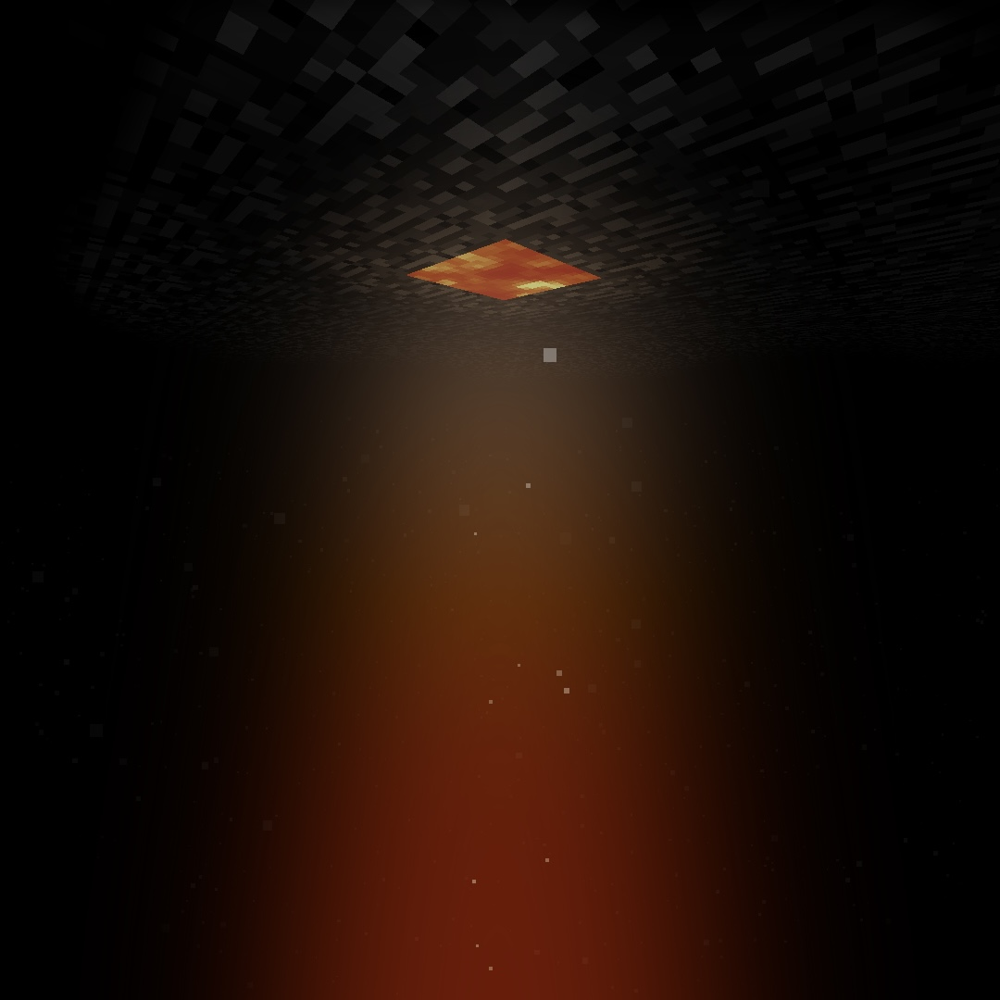

<h1 align="center">CustomVoidLevel</h1>

CustomVoidLevel is a plugin that sets a y-level to be the void (under y-level 0) and allows you to do things when a player is at that y-level (add a command to run in console etc). It also adds a /void command so you can easily change the void level in-game!

Note: There can be some latency between the player falling to the y-level and the payload.

## How to setup?

1. Download the `CustomVoidLevel.phar` file.
2. Drop the plugin file into your server’s plugins folder.
3. Start the server.
4. Configure the config to your hearts content.
5. Restart the server.
6. Enjoy!

## Commands

`/void <y-level | reset>` - Set the void y-level!

## Permissions

`customvoidlevel.void` - Allows a player to run /void

## Report a bug/leave a suggestion!

Feel free to tell me [here](https://github.com/BestCodrEver/CustomVoidLevel/issues/new)!

## For:

This plugin was made with <3 by BestCodrEver for `! !Waltz <3#0505`
